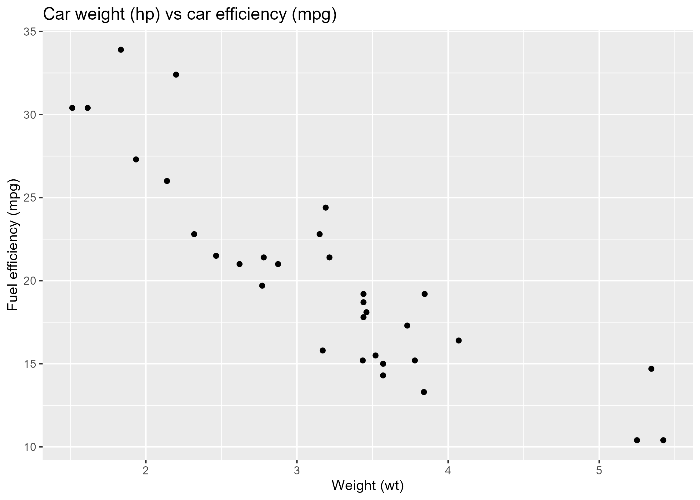

# Manuscript

## Aims

- Study the relationship between car efficiency (mpg) and care weight (wt).

## Results

{width="420"}

Figure 1 shows that there is a negative relationship between car weight and fuel efficiency; in other words increase weight is associated with decreasing the car efficiency.
